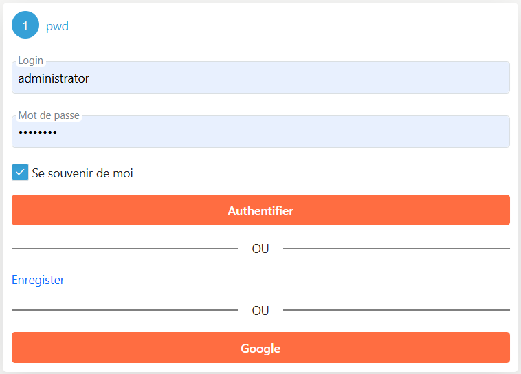

# Login & Password Authentication

Login and password authentication is integrated into all .NET Identity Server templates except for the `idserverempty` template.

## Overview

The core functionality for login and password authentication is provided by the NuGet package `SimpleIdServer.IdServer.Pwd`. 
This package encapsulates the authentication logic required for user login and password management in your identity server implementation.

```bash  title="cmd.exe"
dotnet add package SimpleIdServer.IdServer.Pwd
```

## Dependency Registration

To enable login and password authentication, the necessary dependencies are registered by invoking the `AddPwdAuthentication()` function from the fluent API, typically within the `program.cs` file. This function accepts a parameter that determines whether login and password authentication should be the default method for the identity server.

## Configuration Options

The behavior of the authentication module is configurable via the `appsettings.json` file. To customize the module, add an `IdServerPasswordOptions` section to your configuration file. Within this section, you can set the following parameters:

| Parameter | Description |
| --------- | ----------- |
| NotificationMode | Specifies the communication channel used by the NuGet package to send a URL for updating the password. This could be via SMS, email, or another method. |
| ResetPasswordTitle | Defines the title of the message sent to the user. |
| Message | Contains the content of the message sent to the user. The message should include the URL leading to the password update form. |
| ResetPasswordLinkExpirationInSeconds | Sets the duration (in seconds) after which the password update URL will expire. |
| CanResetPassword | Determines whether the option to reset the password (i.e., the link) should be displayed to the user. |

```json title="appsettings.json"
  "IdServerPasswordOptions": {
    "NotificationMode": "console",
    "ResetPasswordTitle": "Reset your password",
    "ResetPasswordBody": "Link to reset your password {0}",
    "ResetPasswordLinkExpirationInSeconds": "30",
    "CanResetPassword": "true"
  }
```

An Example of a Program.cs File with Login and Password Authentication Enabled

```csharp  title="Program.cs"
var users = new List<User>
{
    UserBuilder.Create("administrator", "password", "Administrator").SetEmail("adm@mail.com").SetFirstname("Administrator").Build()
};

var builder = WebApplication.CreateBuilder(args);
builder.AddSidIdentityServer()
    .AddDeveloperSigningCredential()
    .AddInMemoryUsers(users)
    .AddInMemoryLanguages(DefaultLanguages.All)
    .AddPwdAuthentication(true);

var app = builder.Build();
app.Services.SeedData();
app.UseSid();
app.Run();
```

Example of the Authentication Window:

